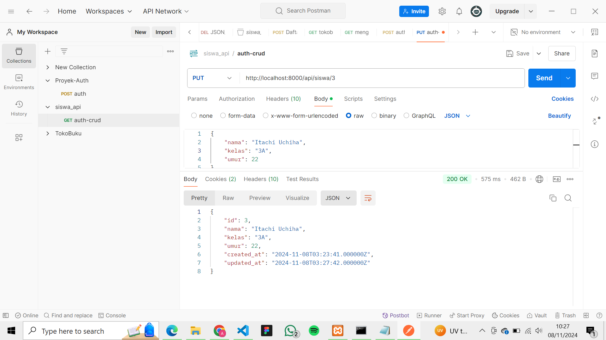
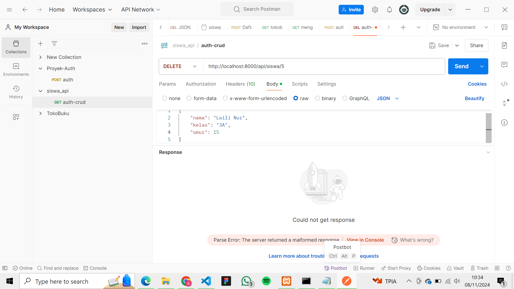

Nama : Arifah Nur Basyiroh Machi
NIM : 362358302018
Kelas : 2B TRPL

Mencoba Registrasi

Mencoba Login

Mencoba CRUD
post

get

get berdasarkan id

put

delete

TUGAS TAMBAHAN
1. Tambahkan	validasi	untuk	memastikan	bahwa:
o Nama	siswa	hanya	mengandung	huruf	dan	spasi.
o Kelas	mengikuti	format	tertentu	(misalnya,	"XII	IPA	1").
o Umur	berada	dalam	rentang	6	hingga	18	tahun

Mencoba post dengan validasi salah
 
Hasilnya adalah 200 OK, tetapi data tidak tersimpan di database 

Mencoba post dengan validasi yang benar

2. Respons	Error	yang	Lebih	Informatif:
o Modifikasi	respons	error	dengan	menambahkan	kode	status	HTTP	dan	
pesan	error	yang	lebih	jelas.	Misalnya,	jika	validasi	gagal,	respons	dapat	
mencakup	detail	kesalahan	yang	spesifik
